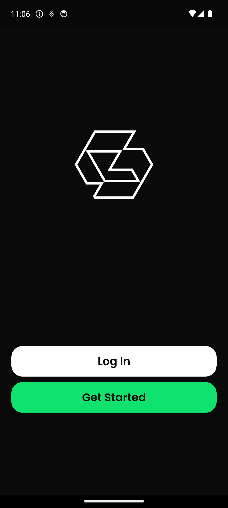

# GymFeed Marketing Product Brief

> Source of truth for marketing managers, copywriters, campaign agents, creators,
> support staff, and partners. Use this document before producing GymFeed copy.
>
> Product snapshot: **28 August 2026**<br>
> App version in repository: **2.1.21 (build 206)**<br>
> Public website: **https://gymfeed.io**<br>
> Android package: **com.flutterflow.gymfeedofficial**

## 1. Rules for anyone marketing GymFeed

1. Use only claims supported by this document. Do not invent prices, accuracy
   percentages, customer counts, health outcomes, or platform availability.
2. Describe GymFeed as an AI-assisted fitness and nutrition product, not a
   doctor, dietitian, physiotherapist, or human personal trainer.
3. Do not imply that a food, equipment, or body scan is medically accurate.
4. Android and the web app are the current public-facing platforms. iOS support
   is being prepared, but must not be advertised as live until the App Store
   listing and production credentials are active.
5. Google is the only supported social sign-in provider in the present product.
   Do not advertise Apple or Facebook sign-in.
6. Premium purchase and restore happen in a supported mobile build. The current
   Flutter web client does not sell or restore RevenueCat subscriptions.
7. The editable Train calendar is currently device-local. Do not promise that
   routine edits, schedules, or workout history sync perfectly across devices.
8. Use **GymFeed Pro** or **Premium** consistently. Do not publish an exact price
   unless it is taken from the current store listing for the target market.

## 2. Product in one sentence

GymFeed combines a fitness social network, workout planning, nutrition tracking,
community events, and an AI coach in one connected app.

## 3. Approved descriptions

### Short description

Share your fitness journey, plan workouts, track meals, join training events,
and get context-aware guidance from GymFeed AI Coach.

### Store-style description

GymFeed brings the social and training sides of fitness together. Follow friends,
share posts and FitClips, build and complete routines, plan meals, track progress,
join local activities, and use AI tools to scan food or equipment. GymFeed AI
Coach uses your goals, plans, recent training, meals, and progress to give more
relevant fitness and nutrition guidance.

### Elevator pitch

Most fitness apps make people choose between a tracker, a meal diary, an AI tool,
and a community. GymFeed puts those experiences in one account. The Home side is
the social layer; the Coach hub is the training product. What a member plans,
logs, learns, and shares can support one continuous fitness journey.

## 4. The core product idea

GymFeed has two complementary sides:

| Side | Purpose | Main experiences |
|---|---|---|
| Social | Motivation, community, discovery, and sharing | Home, Explore, FitClips, Stories, Profiles, Messages |
| Training | Planning, execution, nutrition, progress, and guidance | Coach, Train, Events, scanners, diary, progress |

The bottom navigation is **Home · Explore · Coach · FitClips · Profile**. The
center Coach destination contains a second top switch: **Coach · Train · Events**.

## 5. Feature inventory

### 5.1 Home feed

- Mixed feed of regular fitness posts and food posts.
- Image and video media with portrait and landscape support.
- Food posts are visually marked with a green food icon.
- Flexing-arm reaction, comments, saves, real engagement counts, and sharing.
- Centered video play/pause, mute, elapsed time, and touchable seek bar.
- Stable pagination designed to preserve position while scrolling upward.
- Post captions, locations, tagged users, and optional calls to action.
- Upcoming activities shortcut to the relevant event or joined activity.
- A user sees content from the correct post author; profile posts are not mixed
  with posts belonging to other accounts.

### 5.2 Posts and food posts

- Create a standard post with an image or compressed video.
- Create a food post with media plus meal-specific information.
- Add or edit a caption, location, tagged users, and call-to-action link.
- Food information may include title, description, recipe, nutrition facts,
  cooking time, meal type, calories, protein, carbs, and fat.
- Food detail separates the conversation from meal information through
  **Comments** and **Info** tabs.
- Owners can replace media, edit the post, enable or disable likes, enable or
  disable comments, and delete the post.
- A fast double-tap on feed media opens the corresponding detail experience.

### 5.3 Video delivery

- Native video uploads pass through a shared preparation and compression step.
- New video is uploaded to Bunny Stream through a backend-issued upload ticket.
- The feed can play both newer Bunny HLS assets and supported legacy MP4 assets.
- Newly uploaded media may display a poster while processing and becomes
  playable after encoding is ready.
- The same media rules are used for posts, food posts, stories, messages, and
  workout media.

### 5.4 Stories — “Your gym day”

- Create a story from the camera, gallery, or recent media.
- Photo and video stories expire after 24 hours.
- Story rings, viewing, and view tracking are supported.
- Story visibility respects follow and block relationships.

### 5.5 Explore

- Discover people and fitness content beyond the Home feed.
- Search and browse mixed regular and food content.
- Food content keeps the same green identifier used on Home and Profile.
- Open profiles and content details directly from discovery results.

### 5.6 FitClips

- Full-screen vertical feed focused on workout videos.
- Workout-video-only filtering; static posts and non-workout content are not the
  intended FitClips inventory.
- Full-page playback with social actions and persistent GymFeed navigation.
- Play/pause, sound, and seek controls remain reachable over the video.

### 5.7 Profiles and social graph

- Own and other-user profile views.
- Profile photo, display name, username, biography, website, and social counts.
- Follow and unfollow with follower/following lists and live counters.
- Tabs for the user's posts, tagged content, and workout/event cards.
- The Posts tab includes both standard and food posts; food thumbnails carry a
  green food badge.
- Edit Profile persists account-facing profile fields to Supabase.
- Share profile support.

### 5.8 Likes, comments, saves, and sharing

- GymFeed's signature like/reaction is a flexing-arm icon.
- Engagement counts come from database records rather than placeholders.
- Internal share supports search and multi-select recipients in Messages.
- External share uses a canonical link in this format:
  `https://gymfeed.io/post/<post-id>`.
- Shared links provide a public preview and can open the Android app or web app.
- Copy link, system share, and Story sharing are available where exposed.

### 5.9 Messaging

- Searchable inbox, active status, unread state, and new-message flow.
- Real-time conversation updates and read markers.
- Text, image, and compressed-video messages.
- Shared posts, meals, and workout routines inside conversations.
- Typing/read states and message reactions where the UI exposes them.

### 5.10 Notifications

- In-app notifications for follows, likes, comments, tags, and messages.
- All/Follows/Likes filters and Today/This Week grouping.
- Unread styling, content thumbnails, and follow/following actions.
- Durable source-based deduplication is designed to keep one notification and
  one push job per user action.
- Android push uses a high-importance channel with sound and vibration.
- Firebase Cloud Messaging is used only as push transport; app data remains in
  Supabase.

### 5.11 Blocking and reporting

- Blocking removes follow relationships in both directions.
- Blocked accounts and their content are hidden across feed, profile, events,
  FitClips, stories, search, tagging, and messaging surfaces.
- An account relationship screen explains when access is blocked and supports
  owner-controlled unblocking.
- Members can report a regular post, food post, workout, or account.
- Reports are stored for moderation and can trigger an administrator email.
- Marketing should describe this as community safety tooling, not as an
  automated guarantee that every harmful item is immediately removed.

## 6. Coach hub

### 6.1 Coach home

The Coach home brings together:

- Scan food
- Scan equipment
- AI Trainer / AI Coach
- Body scan
- Nutrition diary
- My Progress & plans
- Weekly activity summary

The three top pills—**Coach, Train, Events**—keep training tools, the workout
calendar, and community activities within one central product.

### 6.2 AI Coach

- Reads the member's private profile, goals, measurements, starter plan,
  editable routines, dated 14-day Train calendar, recent workout history,
  recent meals, and progress records before answering.
- Remembers prior conversation through stored threads, messages, and rolling
  memory.
- Answers only fitness, gym, recovery, food, calorie, macro, and nutrition
  questions; unrelated questions receive a scoped refusal.
- Treats the dated Train calendar as authoritative and says when no workout is
  scheduled instead of inventing one.
- Can recommend rest when the weekly target is already satisfied.
- When a member is behind their weekly target and a safe routine is available,
  it can propose a workout with **Implement** and **Skip** actions.
- Only a confirmed Implement action writes the workout into Train, and success
  is acknowledged only after the write completes.
- Every coaching conversation is general fitness/nutrition guidance and ends
  with the product's health disclosure.

### 6.3 Scan food

- Analyze a meal photo with AI vision.
- Return an estimated portion, ingredients, calories, protein, carbs, and fat.
- Review the result before logging it to the member's Nutrition diary.
- Each scan is mapped to the authenticated account and retains provider/model
  information for diagnostics.

### 6.4 Scan equipment

- Photograph a gym machine for AI-assisted identification.
- Explain the likely machine type, target muscles, and safe-use steps.
- Uses a higher-capability vision model because gym equipment can look similar.
- Results should be treated as guidance; members must follow manufacturer and
  gym instructions when identification is uncertain.

### 6.5 Body scan

- Full-body photo flow with framing and loading states.
- Reports the product's supported progress metrics, including weight, estimated
  body-fat percentage, BMI, and related body-composition measurements.
- Saves reports to the authenticated member for longitudinal progress viewing.
- Estimates are wellness indicators, not clinical measurements or diagnoses.

### 6.6 Nutrition diary

- Navigate to past and future dates.
- Set a daily calorie target.
- Track calories consumed and calories remaining.
- Protein, carbohydrate, and fat progress bars.
- Combine scanned meals, manually logged meals, and AI-planned meals.
- Open a planned meal for ingredients, instructions, and preparation details.
- Log a planned meal into the selected day.

### 6.7 My Progress & plans

- Editable weight and body-fat values.
- Workout frequency, session duration, and workout level.
- Direct links to the member's workout plan and meal plan.
- Monthly progress entries with photos, weight, body fat, date, and notes.
- Edit and delete progress entries.
- Trainer suggestions and a visual month-to-month comparison.

## 7. Train

- Calendar navigation across past, present, and future dates.
- Personalized starter-plan workouts appear on their dated days.
- Premade and member-created routines.
- Add, remove, open, preview, edit, schedule, unschedule, and delete routines.
- Add and remove exercises.
- Configure each exercise with individual sets, reps, and kilograms before a
  workout begins.
- Add and delete sets during the active workout.
- Mark sets complete, use the rest timer, finish the session, and retain history.
- Previous performance supports progressive-overload decisions.

Current limitation: member-created routine edits, schedules, and workout
history use device-local storage. The generated starter-plan source lives in
Supabase, but this Train state is not yet guaranteed to follow the user to
another device or the web session.

## 8. Events

- Discover community workout activities.
- Search and filter by category such as full body, cardio, CrossFit, or legs.
- Create an event with training information, date/time, difficulty, duration,
  location, cover image, and optional video.
- View separate Discover, Joined, and Created sections.
- Open a modern event detail page.
- See the creator and participant count/list.
- Join or leave an event.
- Open a valid location through Google Maps.
- Block relationships are respected when events are queried or displayed.

## 9. Signup and personalized starter plan

### Account flow

1. The member enters full name, a unique username, email, and password.
2. Username availability is checked while typing with a green check or red X.
3. GymFeed sends an email confirmation before exposing a public profile.
4. After verification, onboarding collects goals and preferences.
5. GymFeed generates and validates both personalized plans.

### Onboarding inputs

The questionnaire can include measurements, experience, fitness goal, preferred
training schedule, workout duration, available equipment/location, calorie and
macro context, food preferences, and allergies.

### Generated result

- A dated four-week workout plan with exercises, sets, reps, and starting kg.
- A 28-day meal plan with meals, calorie targets, and macro targets.
- Workouts are imported into Train.
- Planned meals appear in the Nutrition diary and open to preparation details.
- Output is validated for date coverage, numeric bounds, and allergies before it
  is accepted.
- A failed generation gives a clear retry path without discarding answers.
- If generation takes longer than about one minute, the member can continue to
  Home while GymFeed completes the plan and return later.

## 10. Free access and GymFeed Pro

### Free trial behavior

- Free members share **three trial AI uses** across Scan food, Scan equipment,
  and AI Trainer messages.
- Failed provider calls are designed not to consume a trial use.
- Remaining-use messaging appears in the Coach hub.
- At zero uses, the upgrade action opens the premium purchase page.

### GymFeed Pro value proposition

- Unlimited access to the metered AI tools while the entitlement is active.
- Expanded use of food/equipment scanning and AI coaching.
- Access to the premium body-report experience represented in the Coach hub.
- Monthly subscription through the platform store and RevenueCat entitlement
  `premium_features`.
- Restore Purchases is supported on compatible mobile builds.

Do not state an exact price or renewal amount in general campaign copy. Store
pricing can differ by country, currency, platform, promotion, and tax.

## 11. Technology and trust facts

- Flutter app for Android and responsive web.
- Supabase provides authentication, PostgreSQL data, Row Level Security,
  storage, Realtime, RPCs, and server-side Edge Functions.
- OpenAI is the primary provider for plan generation and several AI tools;
  Gemini is used as a fallback in selected flows.
- AI provider keys stay behind authenticated backend functions.
- Bunny Stream handles the modern video encoding and HLS pipeline.
- RevenueCat is the subscription entitlement source of truth.
- FCM provides mobile push transport; GymFeed does not use Firestore as its app
  database.
- Email verification and password reset use Supabase Auth with the configured
  production SMTP sender.
- Account and private fitness data are protected with Supabase Row Level
  Security. Never suggest that all data is public because GymFeed has a feed.

## 12. Target audiences

### Socially motivated gym members

Want accountability, inspiration, and a place to share progress without leaving
their training tools behind.

### New or returning trainees

Need structure: what to train, how many sets and reps, what to eat, and how to
build consistency over a month.

### Self-directed lifters

Want editable routines, kg/reps history, a calendar, meal targets, progress
photos, and an AI assistant that understands their actual plan.

### Fitness creators and coaches

Want workout video discovery, shareable routines, community events, messaging,
and an audience organized around training rather than generic entertainment.

### Nutrition-conscious members

Want a fast way to estimate and log meals, understand macros, and follow a
personalized meal plan day by day.

## 13. Positioning pillars

1. **One connected fitness life** — social posts, workouts, meals, events, and
   progress live in one experience.
2. **An AI coach with context** — it can use the member's real plan and recent
   activity instead of answering as a generic chatbot.
3. **From recommendation to action** — suggestions can become dated Train
   entries after explicit confirmation.
4. **Built for consistency** — a 28-day start, calendar, diary, history, and
   progress photos turn intent into a repeatable routine.
5. **Fitness community, not a generic feed** — FitClips, food posts, events,
   routines, and progress make every social surface training-specific.

## 14. Differentiators

- Social network and workout/nutrition tools share one account and navigation.
- New members receive both a four-week workout plan and a 28-day meal plan.
- AI Coach reads dated training context and is designed not to invent a workout
  for an empty day.
- Explicit confirmation turns an AI proposal into a real calendar entry.
- Equipment recognition sits beside food scanning rather than in a separate app.
- Food posts are structured content with nutrition and preparation information,
  not just photos with captions.
- Community events connect discovery with an actual time, location, creator,
  attendees, and join state.

## 15. Approved messaging and copy bank

### Brand promise

**Your plan. Your progress. Your people. One GymFeed.**

### Headline options

- Train smarter. Share the journey.
- Your fitness life, finally connected.
- Plan it. Log it. Live it.
- A social fitness app that knows your plan.
- Workouts, meals, progress, and community—in one feed.
- Turn today's motivation into the next 28 days.

### Supporting lines

- Build routines, log meals, join activities, and get AI guidance grounded in
  your actual fitness journey.
- Scan a meal. Decode a machine. Plan a workout. Track the change.
- Your Coach hub brings training, nutrition, and progress together.
- Share FitClips and food posts without losing the data behind them.

### Calls to action

- Get started with GymFeed
- Build my 28-day plan
- Open Coach
- Start today's workout
- Scan and log a meal
- Find a training event
- Share your progress
- Unlock GymFeed Pro

### Avoid these claims

- “Guaranteed results”
- “Clinically accurate body scan”
- “Replaces your doctor/dietitian/trainer”
- “Every video is instantly available”
- “Syncs every workout edit across every device”
- “Available on iPhone” until the public iOS release is confirmed
- “Free forever” or a hard-coded premium price

## 16. Campaign ideas

### 28-day launch sequence

- Day 1: “Your complete month starts at signup.”
- Day 3: Show an editable Train session with kg and reps.
- Day 5: Scan a plate and log it to Nutrition diary.
- Day 7: Weekly progress recap.
- Week 2: Ask AI Coach about today's dated plan.
- Week 3: Share a FitClip or structured food post.
- Week 4: Compare monthly progress and plan the next cycle.

### Short-form content hooks

- “What if your fitness feed knew today's workout?”
- “This machine has confused everyone at least once.”
- “Photo → macros → diary.”
- “No workout scheduled? Your AI Coach should say so.”
- “A food post that includes the actual recipe.”
- “From AI suggestion to your Train calendar in one confirmation.”
- “One month of workouts and meals, built together.”

## 17. Brand and visual direction

- Primary experience: deep black and charcoal surfaces.
- Accent: vivid GymFeed green.
- Typography: bold, rounded, high-contrast headings with readable supporting
  copy; the app uses Poppins styling.
- Components: rounded cards, pill switches, large media, restrained borders,
  and simple line icons.
- Imagery: authentic training, meal preparation, equipment, progress, and
  community. Prefer real action over generic stock-gym poses.
- Screenshot captions should explain the benefit visible on screen in one short
  sentence.
- Never place small white text directly on a bright or detailed image without a
  dark gradient or solid card behind it.

## 18. Screenshot brief

Create screenshots from an authenticated production-like demo account with no
personal or sensitive information. Recommended sequence:

1. **Home** — mixed video and food content, real controls, green food badge.
2. **Coach hub** — free-use indicator, Pro card, six connected tools.
3. **AI Coach** — a dated, context-aware answer plus Implement/Skip proposal.
4. **Train** — selected date, workout card, routine sets/reps/kg.
5. **Nutrition diary** — calorie goal, macros, planned and logged meals.
6. **Scan food result** — reviewed macros before logging.
7. **Scan equipment result** — identified machine and target muscles.
8. **Progress** — weight/body fat cards and monthly photo comparison.
9. **Events** — filters plus Joined/Created state and an event detail.
10. **FitClips** — full-screen workout video with actions and controls.
11. **Messages** — media and shared workout inside a conversation.
12. **Profile** — mixed post grid, food badge, and workout/event card.

For store assets, capture the exact shipping build on a clean Android emulator
or physical phone. Do not use old design prototypes as evidence of live
behavior. Crop status-bar notifications and real names unless permission has
been obtained.

### Verified current-build capture

The following image was captured from the installed Android build on the local
GymFeed emulator. It is suitable as a reference or login/start screen asset:



Authenticated feature screenshots still require a clean demo account. Do not
sign in with a personal production account solely to manufacture campaign art.

## 19. Platform and release status

| Capability | Status marketers may state |
|---|---|
| Android app | Available/current product platform; verify store listing before linking a campaign |
| Responsive web app | Live at gymfeed.io |
| iOS app | In preparation; do not market as publicly available yet |
| Google sign-in | Supported when provider configuration remains enabled |
| Email/password, verification, reset | Supported through Supabase Auth and production SMTP |
| Apple sign-in | Not offered in the current UI |
| Facebook sign-in | Not offered in the current UI |
| Mobile premium purchase/restore | Supported on configured mobile builds |
| Web premium checkout | Not supported by the present client |
| Cross-device Train edits/history | Not yet guaranteed |

## 20. Marketing-manager context block

Use the following as the compact instruction block for an AI marketing manager:

```text
You market GymFeed, a social fitness and AI coaching ecosystem. Its social side
contains Home, Explore, FitClips, Stories, Profiles, Messages, engagement,
sharing, tagging, events, blocking, and reporting. Its Coach hub contains Coach,
Train, and Events. Coach tools include context-aware AI Coach, food scan,
equipment scan, body scan, Nutrition diary, and My Progress & plans. New verified
members complete onboarding and receive a validated four-week workout plan plus
a 28-day meal plan. Free members share three trial uses across food scan,
equipment scan, and AI Trainer; active GymFeed Pro members receive unlimited
metered AI-tool use. The current public platforms are Android and responsive web.
iOS is in preparation. Google is the only current social login. Never make
medical, guaranteed-results, accuracy, exact-pricing, Apple-login, Facebook-login,
iOS-live, web-purchase, or cross-device-Train-sync claims. Emphasize one connected
fitness journey, context-aware AI, actionable planning, community, and progress.
```

## 21. Final pre-publication checklist

- Confirm the target platform and current store URL.
- Confirm the current premium price in that platform and country if price is shown.
- Confirm the screenshot is from the shipping build, not a design mockup.
- Remove demo names, emails, notifications, and private profile data.
- Check that food/body/equipment language says “estimate,” “likely,” or
  “AI-assisted” where appropriate.
- Include the health disclosure for long-form AI Coach promotions.
- Do not imply that FCM is the GymFeed backend; Supabase is the system of record.
- Keep the GymFeed spelling and green/black visual identity consistent.
- Send every paid claim, medical-adjacent claim, and subscription statement for
  product/legal review before publishing.
